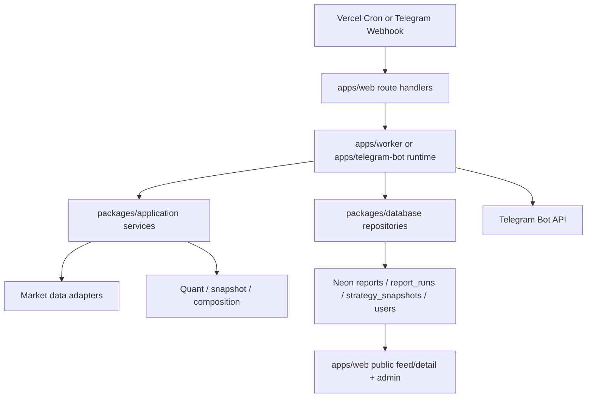

# System Architecture

## 목적

이 문서는 현재 `stock-chatbot`의 실제 런타임 구조를 코드 기준으로 설명한다.
README의 개요보다 더 깊게, 트리거가 발생한 뒤 최종 브리핑이 사용자에게 도달할 때까지의 상세 흐름을 정리한다.

우선순위 기준 문서:

- `docs/initial-prd.md`
- `docs/phase-plan.md`
- `docs/change-log.md`
- `docs/context-summary.md`

## 1. Runtime Topology

| Layer | Primary Runtime | Responsibility |
| --- | --- | --- |
| Public web | `apps/web` | public feed/detail, `/admin`, Telegram webhook, cron entrypoint |
| Telegram command logic | `apps/telegram-bot` | command assembly, registration, conversation state, on-demand `/report` |
| Scheduled orchestration | `apps/worker` | public briefing generation, scheduled daily report execution |
| Shared application | `packages/application` | market data, quant, briefing composition, renderer, session rules |
| Persistence | `packages/database` | schema, repositories, read/write models |
| Production infra | `Vercel + Neon + Telegram Bot API` | HTTP runtime, Postgres, final delivery |
| Backup/manual ops | `GitHub Actions` | reconcile/manual rerun/smoke |

고정 경계:

- 개인화 입력과 개인화 리포트 delivery는 Telegram DM 전용
- 공개 브리핑은 `reports` read model을 통해 web feed/detail에 노출
- production primary runtime은 polling이 아니라 `apps/web`의 webhook/cron route

## 2. High-Level Data Flow

## 3. Scheduled Morning Briefing Flow

이 섹션은 `07:30 KST pre_market` 정기 브리핑이 실행될 때의 실제 흐름을 설명한다.

### 3.1 Trigger Entry

진입점:

- `GET /api/cron/daily-report`
- 구현 위치: `apps/web/app/api/cron/daily-report/route.ts`

순서:

1. route가 `CRON_SECRET` 기반 인증을 검사한다.
2. `readCronRuntimeEnvironment()`가 runtime env를 모은다.
3. `resolveRequestedBriefingSessions()`가 현재 시점과 타임존을 기준으로 세션을 결정한다.
4. `schedule` 트리거일 때 `runBriefingSession()`이 세션별로 순차 실행된다.

세션 규칙:

- `pre_market`: `월~토` 허용
- `post_market`: `월~금` 허용
- `weekend_briefing`: `토요일 08:00 KST` 공개 브리핑 전용
- 구현 기준: `packages/application/src/briefing-session.ts`

### 3.2 Session Orchestration

핵심 함수:

- `apps/web/lib/briefing-cron.ts`
- `runBriefingSession({ briefingSession, runtimeEnv, triggerType })`

핵심 규칙:

1. `schedule` 트리거면 먼저 `isScheduledBriefingSessionAllowed()`로 오늘 허용 세션인지 확인한다.
2. 세션별 env를 구성한다.
   - `BRIEFING_SESSION`
   - `REPORT_TRIGGER_TYPE`
   - 필요 시 `REPORT_RUN_DATE`
3. 먼저 `runPublicBriefingWithRetry()`를 호출한다.
4. public briefing 결과 URL을 확보한 뒤 `runDailyReport()`를 호출한다.

이 순서가 중요한 이유:

- scheduled daily report는 개인화 본문 하단에 공개 링크를 붙일 수 있어야 한다.
- 그래서 현재 기준선은 `공개 브리핑 업로드 -> 개인 발송` 순서다.

### 3.3 Public Briefing Build Path

구현 위치:

- `apps/worker/src/run-public-briefing.ts`

상세 흐름:

1. `readRunDate()`가 run date를 결정한다.
   - schedule에서는 현재 `Asia/Seoul` 날짜를 사용
   - manual/workflow_dispatch는 필요 시 override 허용
2. `readPublicBriefingSession()`이 `pre_market`, `post_market`, `weekend_briefing` 중 하나를 결정한다.
3. market snapshot 수집:
   - `CompositeMarketDataAdapter`
   - `FredMarketDataAdapter`
   - `YahooFinanceScrapingMarketDataAdapter`
4. 공개용 거시 뉴스 수집/분석:
   - `MacroTrendNewsService`
   - `NEWS_SOURCE_CONFIGS`
   - Upstash REST cache (`UPSTASH_REDIS_REST_URL`, `UPSTASH_REDIS_REST_TOKEN`)가 있으면 dedupe/hot cache/analysis cache 사용
   - source-of-truth는 Postgres `news_items`, `news_analysis_results`
5. 기본 지표 목록:
   - `DEFAULT_MARKET_WATCH_CATALOG`
6. quant summary 생성:
   - `buildQuantScorecards()`
   - `toQuantStrategyBullets()`
7. 가능하면 LLM composition 수행:
   - `DailyReportCompositionService.compose(audience: "public_web")`
8. 실패 시 fallback:
   - `buildRuleBasedBriefing()`
9. 최종 public payload 생성:
   - `buildPublicDailyBriefing()`
10. JSON artifact 저장:
   - 기본 경로 `artifacts/public-briefing/public-daily-briefing-<session>.json`
11. DB가 있으면 `NewsItemRepository`, `NewsAnalysisResultRepository`, `PublicReportRepository` 순서로 저장
12. `PUBLIC_BRIEFING_BASE_URL`이 있으면 `reports/[uuid]` URL 생성

공개 브리핑 뉴스 정책:

- `public_web` composition 입력에는 `macroTrendBriefs`만 넣고 종목별 `newsBriefs`는 비운다.
- 공개 markdown/detail은 `headlineEvents`, `trendNewsBullets`, `newsReferences`를 노출한다.
- `headlineEvents`는 실제 RSS headline과 브리핑용 요약 제안을 함께 보여주는 구조이고, `eventBullets`는 세션별 체크포인트/일정 섹션에 사용한다.
- `weekend_briefing` 세션에서는 daily Telegram 발송 없이 공개 브리핑만 생성한다.

post-market 특수 처리:

- 같은 날짜의 `pre_market` public report가 이미 있으면
- `findLatestByReportDateAndSession(runDate, "pre_market")`로 prior summary/signals를 읽고
- `sessionComparison`으로 composition 입력에 넣는다

retry 정책:

- delay: `10초 -> 20초`
- public briefing URL을 확보할 때까지 최대 3회 시도
- 끝내 실패하면 scheduled daily report는 계속 보내되 공개 링크는 붙지 않는다

### 3.4 Scheduled Daily Report Processor

구현 위치:

- `apps/worker/src/process-daily-report.ts`
- `buildDailyReportJobProcessor()`

초기화 단계:

1. `DATABASE_URL`, `FRED_API_KEY`, optional LLM key, Telegram token을 읽는다.
2. Neon/local Postgres pool을 연다.
3. repository를 생성한다.
   - `UserRepository`
   - `PortfolioHoldingRepository`
   - `ReportRunRepository`
   - `PublicReportRepository`
   - `StrategySnapshotRepository`
   - `PersonalRebalancingSnapshotRepository`
4. application service를 조립한다.
   - `DailyReportOrchestrator`
   - optional `PortfolioNewsBriefService`
   - optional `DailyReportCompositionService`
5. Telegram token이 있으면 `TelegramReportDeliveryAdapter`를 생성한다.

### 3.5 Due User Selection

함수:

- `processDailyReportJob()`

순서:

1. `UserRepository.listUsers()`로 전체 사용자 목록을 읽는다.
2. 아래 사용자는 즉시 제외한다.
   - `dailyReportEnabled === false`
   - `isBlocked === true`
   - `isRegistered === false`
3. 남은 사용자마다 `DailyReportOrchestrator.runForUser()`를 호출한다.
4. 성공/부분성공만 delivery 단계로 넘어간다.

현재 구조상 scheduled path는 사용자별 시간대 계산보다 `dailyReportEnabled`와 운영 세션 게이트를 우선 사용한다.

### 3.6 Per-User Orchestration

핵심 구현:

- `packages/application/src/daily-report-orchestrator.ts`

사용자별 단계:

1. `report_runs.startRun()` 호출
   - unique key: `(user_id, run_date, schedule_type)`
   - 중복이면 `skipped_duplicate`
2. holdings 조회:
   - `PortfolioHoldingRepository.listByUserId()`
3. market snapshot 조회:
   - `marketDataAdapter.fetchMany()`
4. optional portfolio news 수집:
   - `PortfolioNewsBriefService.generateBriefsForHoldings()`
5. optional macro trend 수집:
   - `MacroTrendNewsService.collect(scope: "macro")`
   - `MacroTrendNewsService.analyzeMacroTrends()`
6. holding price snapshot 조회:
   - `YahooHoldingPriceSnapshotProvider`
7. quant scorecard 계산:
   - `buildQuantScorecards()`
8. strategy snapshot 저장:
   - `StrategySnapshotRepository.insertMany()`
9. 개인화 rebalancing payload 결정:
   - provided payload 우선
   - 없으면 `personal_rebalancing_snapshots` cache 조회
   - stale/missing이면 `buildPersonalRebalancingSnapshot()`으로 새로 생성 후 upsert
10. optional LLM composition:
   - `DailyReportCompositionService.compose(audience: "telegram_personalized")`
11. 실패 시 fallback briefing 생성:
   - `buildRuleBasedBriefing()`
12. public link 결정:
   - cron에서 직접 받은 `publicBriefingUrl` 우선
   - 없으면 `publicBriefingBaseUrl + latest report id` fallback 조회
13. 최종 텍스트 렌더링:
   - `renderTelegramDailyReport()`
13. `report_runs.completeRun()`으로 `completed`, `partial_success`, `failed` 기록

실패 처리:

- orchestration 중 예외가 나면 best-effort로 `report_runs`를 `failed`로 마감
- stale `running` row를 남기지 않는 것이 현재 guardrail

### 3.7 Telegram Delivery

전송 단계:

1. orchestrator가 `completed` 또는 `partial_success`를 반환해야 한다.
2. user에 `preferredDeliveryChatId`가 있어야 한다.
3. `TelegramReportDeliveryAdapter.deliver()`가 실제 Bot API `sendMessage` 호출
4. 성공 시 `deliveredCount` 증가
5. 실패 시 `deliveryFailedCount` 증가

outbound audit:

- `apps/telegram-bot/src/build-bot.ts`에서 `bot.api.config.use(...)` 미들웨어가 `sendMessage`를 후킹
- `telegram_outbound_messages`에 chat/message/text를 저장
- live E2E와 운영 디버깅에서 이 로그를 사용한다

### 3.8 Result Visibility

scheduled session이 끝나면 결과는 세 군데에 남는다.

| Output | Location | Purpose |
| --- | --- | --- |
| Public report | `reports` | public feed/detail, admin latest report |
| Personal run log | `report_runs` | user별 성공/실패/중복 추적 |
| Strategy snapshot | `strategy_snapshots` | `/admin` 회고, score tuning |

## 4. On-Demand `/report` Flow

이 경로는 사용자가 Telegram DM에서 직접 `/report`를 실행할 때의 흐름이다.

### 4.1 Webhook Entry

진입점:

- `POST /api/telegram/webhook`
- 구현 위치: `apps/web/app/api/telegram/webhook/route.ts`

순서:

1. webhook secret 필수 여부 검사
2. `x-telegram-bot-api-secret-token` 인증
3. raw body에서 `update_id` 추출
4. `telegram_processed_updates.markProcessed(updateId)`로 dedupe
5. 이미 처리된 update면 `200`으로 종료
6. 아니면 `buildTelegramBotApp()` 기반 grammY handler로 전달

### 4.2 Bot Command Layer

구현 위치:

- `apps/telegram-bot/src/build-bot.ts`

`/report` command 처리 순서:

1. private chat인지 확인
2. `telegram_user_id` 추출
3. registered user 확인
4. current DM chat이 `preferredDeliveryChatId`인지 확인
5. `TelegramRequestGuard.consumeFeatureRequest(eventKind: "report_request")`
6. 먼저 `"브리핑을 생성하고 있습니다"` 메시지 전송
7. `resolveTelegramReportRunDate()`로 KST 요청일 계산
8. `resolveTelegramBriefingSession()`로 수동 세션 결정
   - `00:00~15:29` -> `pre_market`
   - `15:30~23:59` -> `post_market`
9. `buildTelegramReportRuntime().reportService.runForTelegramUser()` 호출
10. 결과가 실패/중복이면 follow-up error message 응답
11. 정상 결과면 rendered report text를 DM에 전송

### 4.3 Telegram Report Runtime

구현 위치:

- `apps/telegram-bot/src/report-service.ts`

역할:

- on-demand `/report`를 위해 worker 쪽과 동일한 `DailyReportOrchestrator` graph를 private runtime으로 조립한다
- 차이는 Telegram command path에서 직접 `deliver()`하지 않고, 결과 텍스트를 command handler가 `context.reply()`로 전송한다는 점이다

즉, scheduled path와 on-demand path는 아래를 공유한다.

- market data adapter
- rebalancing snapshot cache
- report_runs 기록
- strategy snapshot 기록
- public report lookup
- telegram renderer

## 5. Public Web Read Path

### 5.1 Feed / Detail

구현 위치:

- `apps/web/lib/public-reports.ts`

읽기 방식:

1. `unstable_noStore()`로 정적 캐시를 비활성화
2. `getWebPool()`로 DB pool 획득
3. `reports` read model을 직접 조회
4. `indicator_tags` 또는 `briefing_session` 컬럼이 아직 없는 legacy schema면 fallback query 수행
5. page는 조회 결과를 그대로 렌더링

중요한 점:

- 현재 public feed/detail은 build 시점 정적 HTML이 아니라 dynamic DB read다
- 공개 브리핑이 적재되면 redeploy 없이 반영되어야 한다

### 5.2 Admin

구현 위치:

- `apps/web/lib/admin-dashboard.ts`

`/admin`이 읽는 주요 모델:

- `reports`
- `report_runs`
- `strategy_snapshots`
- `users`
- `telegram_request_events`

역할:

- latest report 확인
- 최근 run status 요약
- 최근 전략 스냅샷 회고
- 사용자 block/register/request 사용량 확인

## 6. Persistence Model Map

| Table | Role | Written By | Read By |
| --- | --- | --- | --- |
| `users` | Telegram 사용자/설정 상태 | register/unregister/admin | bot, worker, admin |
| `portfolio_holdings` | 사용자 보유 종목 | `/portfolio_add`, `/portfolio_bulk`, `/portfolio_remove` | orchestrator, list command |
| `ticker_masters` | 검색용 종목 마스터 | ticker import job | ticker search |
| `report_runs` | 개인화 브리핑 실행 로그 | orchestrator | admin, `/report` duplicate handling |
| `personal_rebalancing_snapshots` | 개인화 rebalancing cache | orchestrator | orchestrator |
| `reports` | 공개 브리핑 read model | public briefing builder | public feed/detail, admin, personal link lookup |
| `strategy_snapshots` | 종목별 전략 스냅샷 | orchestrator | admin backtest summary |
| `telegram_processed_updates` | webhook update dedupe | webhook route | webhook route |
| `telegram_outbound_messages` | outbound audit log | bot API middleware | live E2E, ops debugging |
| `telegram_request_events` | limit/flood tracking | request guard | request guard, admin |
| `telegram_conversation_states` | Telegram multi-step input state | bot conversation layer | bot conversation layer |

## 7. Failure Handling and Guardrails

| Concern | Current Behavior |
| --- | --- |
| Webhook replay | `telegram_processed_updates` dedupe |
| Missing webhook secret | request rejected with `401/500` |
| LLM failure | rule-based fallback briefing 유지 |
| Missing public report row | personal report는 계속 보내고 링크만 생략 가능 |
| Duplicate run | `report_runs` unique key로 `skipped_duplicate` |
| Orchestrator exception | `report_runs`를 best-effort `failed`로 정리 |
| Legacy schema drift | public feed/detail와 `/report`에서 graceful fallback |
| Flood / daily limit | `telegram_request_events` 기반 request guard |
| Public/private boundary | public web는 `reports`만 읽고 개인 holdings/news/scorecard는 노출하지 않음 |

## 8. Environment Variables That Shape Architecture

| Env | Used In | Effect |
| --- | --- | --- |
| `DATABASE_URL` | web, worker, bot | 모든 read/write model 연결 |
| `TELEGRAM_BOT_TOKEN` | webhook, worker, bot | Bot API sendMessage 및 bot identity |
| `TELEGRAM_WEBHOOK_SECRET_TOKEN` | webhook | inbound 인증 |
| `CRON_SECRET` | cron routes | schedule/reconcile 보호 |
| `PUBLIC_BRIEFING_BASE_URL` | worker, webhook runtime | Telegram에 붙는 공개 detail URL 기준 |
| `FRED_API_KEY` | worker, bot runtime | macro/FX/rates data 수집 |
| `OPENAI_API_KEY` / `GEMINI_API_KEY` | worker, bot runtime | optional composition/news enrichment |
| `REPORT_TIMEZONE` | cron/session resolution | `Asia/Seoul` 기준 세션 판단 |
| `REPORT_RUN_DATE` | worker/manual paths | backfill/manual rerun 날짜 고정 |

## 9. Architecture Summary

현재 시스템은 하나의 monorepo 안에서 두 개의 핵심 delivery path를 가진다.

1. scheduled path
   - Vercel cron -> public briefing build -> per-user orchestrator -> Telegram Bot API delivery
2. on-demand path
   - Telegram webhook -> command/runtime checks -> shared orchestrator -> DM reply

두 경로는 서로 다른 진입점을 갖지만, 아래 핵심 계층을 공유한다.

- market data adapters
- quant/rebalancing logic
- persistence repositories
- Telegram renderer
- public report lookup contract

그래서 이 프로젝트의 아키텍처 핵심은 “entrypoint는 다르지만, 분석과 상태 기록은 같은 core graph를 공유한다”는 점이다.
